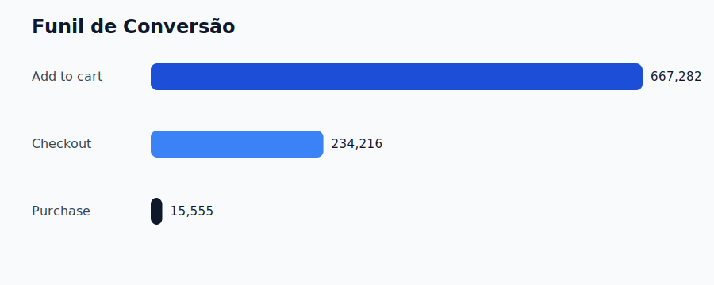
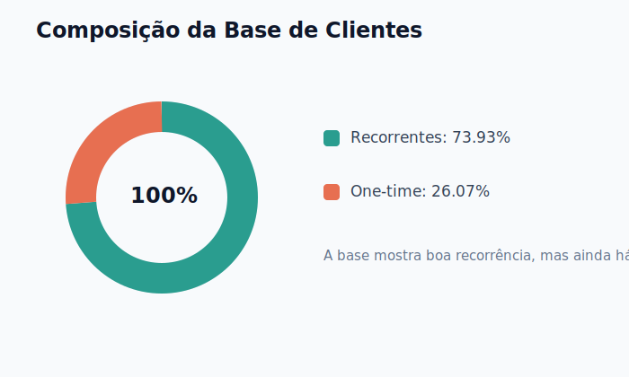
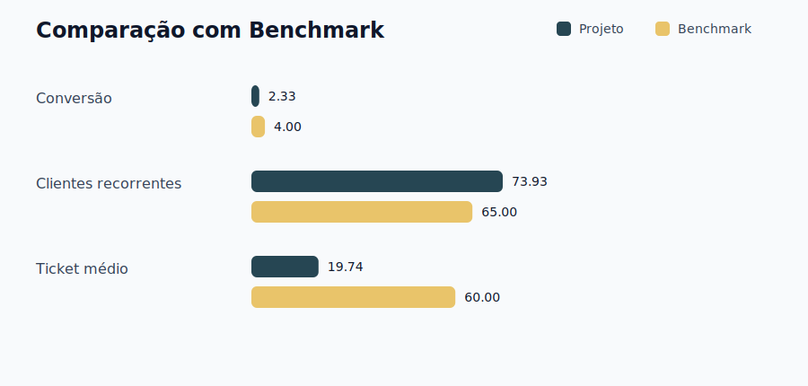
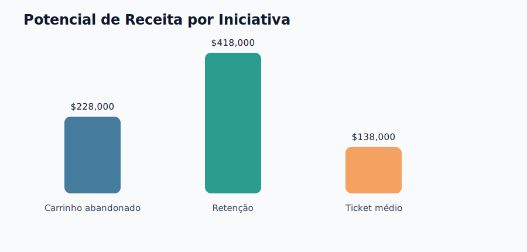

# Digital Marketing Analytics

Relatório Executivo de Análise de E-commerce

**Autora:** Ludmilla Sousa Quirino  
**Data:** 24/04/2026

---

## Resumo Executivo

Esta análise avaliou a jornada de compra de um e-commerce a partir de 758.884 eventos, com foco em conversão, retenção e potencial de crescimento comercial. Os resultados mostram uma operação com receita relevante, mas com perdas expressivas ao longo do funil e oportunidade clara de aumento de valor por cliente.

### Principais métricas

| Métrica | Valor | Leitura |
| --- | ---: | --- |
| Receita total | $307,114.00 | Base atual do negócio |
| Ticket médio | $19.74 | Potencial para aumento |
| Conversão `add_to_cart -> purchase` | 2.33% | Principal gargalo |
| Conversão `add_to_cart -> checkout` | 35.10% | Queda relevante |
| Conversão `checkout -> purchase` | 17.00% | Etapa crítica |
| Clientes recorrentes | 73.93% | Base com bom sinal de retenção |
| Clientes one-time | 26.07% | Espaço para reengajamento |

### Leitura executiva

- O principal problema do negócio está na baixa conversão entre carrinho e compra.
- O ticket médio ainda limita o crescimento da receita mesmo com volume relevante.
- A base possui bons sinais de recorrência, mas ainda perde aproximadamente 1,060 clientes após a primeira compra.
- Há oportunidade de captura de valor em três frentes: recuperação de carrinho, retenção e aumento de ticket médio.

### Visualizações

---

## Análise Detalhada

### Panorama da base

- Total de eventos: 758,884
- Total de clientes: 4,066
- Total de produtos: 1,381
- Receita por cliente: $75.53

### Funil de conversão

| Etapa | Volume | Taxa sobre `add_to_cart` |
| --- | ---: | ---: |
| Add to cart | 667,282 | 100.00% |
| Checkout iniciado | 234,216 | 35.10% |
| Compra concluída | 15,555 | 2.33% |

### Diagnóstico

1. A maior perda acontece entre carrinho e checkout, o que sugere fricção relevante no processo de compra.
2. A segunda perda relevante ocorre na etapa final, entre checkout e compra, possivelmente ligada a pagamento, custo final ou experiência.
3. O ticket médio baixo reduz o potencial de receita por pedido e aponta espaço para estratégias de upsell e cross-sell.
4. A presença de clientes one-time mostra que a empresa ainda pode amadurecer suas ações de CRM e retenção.

### Benchmark de referência

| Indicador | Projeto | Referência de mercado | Interpretação |
| --- | ---: | ---: | --- |
| Conversão `add_to_cart -> purchase` | 2.33% | 3% a 5% | Abaixo da média |
| Clientes recorrentes | 73.93% | 60% a 70% | Sinal positivo |
| Ticket médio | $19.74 | $45 a $75 | Abaixo da referência |

---

## Plano de Ação

### Prioridade 1: Recuperação de carrinho abandonado

- Objetivo: reduzir a perda entre `add_to_cart` e compra.
- Impacto estimado: +$228,000 em receita.
- Ações sugeridas:
  - fluxo de email de recuperação em 3 etapas;
  - revisão do checkout para reduzir atrito;
  - teste de incentivo pontual para fechamento de compra.

### Prioridade 2: Retenção de clientes

- Objetivo: aumentar recompra e reduzir a proporção de clientes one-time.
- Impacto estimado: +$418,000 em receita.
- Ações sugeridas:
  - sequência de relacionamento pós-compra;
  - campanha de reengajamento;
  - programa simples de fidelização ou benefícios.

### Prioridade 3: Aumento do ticket médio

- Objetivo: elevar o valor médio por pedido.
- Impacto estimado: +$138,000 em receita.
- Ações sugeridas:
  - recomendação de produtos complementares;
  - incentivo por faixa de valor;
  - bundles ou kits promocionais.

### Priorização sugerida

1. Carrinho abandonado
2. Retenção de clientes
3. Aumento de ticket médio

---

## Monitoramento

### KPIs principais

| KPI | Baseline | Meta inicial |
| --- | ---: | ---: |
| Conversão `add_to_cart -> purchase` | 2.33% | 3.50% |
| Ticket médio | $19.74 | $23.00 |
| Clientes recorrentes | 73.93% | 80.00% |
| Receita por cliente | $75.53 | $90.00 |

### Rotina sugerida

- acompanhar os KPIs semanalmente;
- revisar desempenho das iniciativas a cada 30 dias;
- registrar testes, aprendizados e próximas iterações.

---

## Arquivos de apoio

- `ecommerce_customer_analysis.ipynb`: notebook com a análise exploratória completa.
- `reports/dados_resumidos.json`: resumo estruturado das métricas do relatório.
- `reports/images/`: gráficos exportados para leitura direta no GitHub.
- `gerar_relatorio_completo.py`: script para regenerar os arquivos desta seção.
